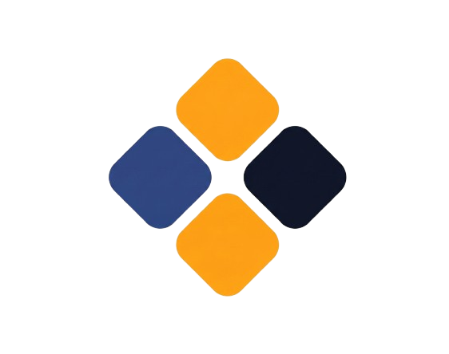

<h1 align="center">Gridworks</h1>

<p align="center">

  
</p>

<p align="center">
  <strong>Transform raw, messy university schedule PDFs into clean, beautiful, print-ready calendar grids in under 3 seconds.</strong>
</p>

<p align="center">
  
  
  
  
</p>

<p align="center">
  <a href="https://gridworks.vercel.app" target="_blank" rel="noopener noreferrer">
    
  </a>
</p>

---

## 📋 Table of Contents

- [About the Project](#-about-the-project)
  - [How It Works Under the Hood](#how-it-works-under-the-hood)
- [✨ Key Features](#-key-features)
- [🛠️ Tech Stack](#-tech-stack)
- [🚀 Getting Started](#-getting-started)
  - [Prerequisites](#prerequisites)
  - [Installation](#installation)
  - [Environment Configuration](#environment-configuration)
- [💡 Usage Flow](#-usage-flow)
- [📄 License & Contact](#-license--contact)

---

## 🔍 About the Project

Every semester, university students receive raw, poorly formatted registration forms and schedule sheets in PDF format. Translating these lists of times, days, and room numbers into a usable weekly calendar is a tedious, manual process.

**Gridworks** solves this friction entirely. It is a modern, high-performance web application that extracts course schedules from unstructured PDF files or images and dynamically renders them into a customizable, visually stunning calendar canvas.

### How It Works Under the Hood

Gridworks features an advanced parsing pipeline designed for maximum accuracy without rigid template layouts:

1. **Spatial Extraction (`pdfExtractor.js`):** The PDF is parsed to extract text nodes along with their precise `X` and `Y` coordinates. Characters and words on the same horizontal plane are grouped into rows.
2. **Tabular Reconstruction:** By evaluating horizontal gaps, columns are mapped using an adaptive delimiter threshold. This helps identify columns even in documents with complex column spacing.
3. **Adaptive Tokenization (`regexTokenizer.js`):** The system maps headers (such as Course Code, Time, Room, and Day) using an extensive dictionary of synonyms. It scores rows to identify the table header and correctly map the schema.
4. **AI Image Pre-Check (`llmFallback.js`):** For image uploads, the system uses the Gemini API as a classification gateway to analyze the image structure and ensure it is a valid schedule before kicking off processing.

---

## ✨ Key Features

- **⚡ Instant Intake:** Drag and drop your raw schedule PDF or registration form. The system parses all items in under three seconds.
- **🎨 Interactive Canvas:** Modify schedule colors, toggle grid layouts, adjust card styling (borders, shadows, backgrounds), and preview changes in real time.
- **✏️ Precision Editing:** A dedicated sidebar allows you to manually add courses, fix typos, adjust start/end times, and override individual schedule block colors.
- **💾 Print-Ready Export:** Download your personalized schedule canvas as an optimized, high-quality PNG or print-friendly format.

---

## 🛠️ Tech Stack

### Frontend & Styling

- **Core:** React 19, Next.js 15 (App Router), TypeScript
- **Styling:** Tailwind CSS, Vanilla CSS custom configurations
- **Icons:** Lucide React

### Parsing & OCR

- **PDF Extractor:** `pdf2json` (Server-side API extraction) & `pdfjs-dist` (Client-side extraction fallback)
- **OCR:** Tesseract.js (for extraction from raw image uploads)

### AI Integration

- **Document Verification:** Google Gemini API (via `gemini-2.0-flash`)

---

## 🚀 Getting Started

### 🌐 Live Deployment

You can use the live application directly without any setup:
👉 **[gridworks.vercel.app](https://gridworks.vercel.app)**

---

### Local Development

If you prefer to run the project locally on your machine, follow the steps below:

#### Prerequisites

Make sure you have the following installed on your local machine:

- **Node.js** (v18.0.0 or higher)
- **npm** (v9.0.0 or higher) or **Yarn**

### Installation

1. **Clone the repository:**

   ```bash
   git clone https://github.com/vardzz/gridworks.git
   cd gridworks
   ```

2. **Install dependencies:**

   ```bash
   npm install
   # or
   yarn install
   ```

3. **Run the development server:**

   ```bash
   npm run dev
   # or
   yarn dev
   ```

4. Open [http://localhost:3000](http://localhost:3000) with your browser to see the application.

### Environment Configuration

Create a `.env.local` file in the root directory and add your Google Gemini API key:

```env
# Google Gemini API key used for image validation & pre-checks
NEXT_PUBLIC_GEMINI_KEY=your_gemini_api_key_here
```

> [!NOTE]
> You can obtain a free Gemini API key from the Google AI Studio console. If no key is provided, the application will default to skipping the AI classification check.

---

## 💡 Usage Flow

1. **Upload:** Drop your schedule PDF onto the Intake screen.
2. **Review:** Inspect the parsed courses in the left sidebar. Correct any misaligned entries or add new classes manually.
3. **Customize:** Use the right sidebar to change canvas themes, card sizes, fonts, and active grid constraints.
4. **Export:** Click the "Export" button on the preview canvas to save your optimized schedule card.

---

## 📄 License & Contact

Distributed under the MIT License. See `LICENSE` for more information.

Developed by the Gridworks Solo Developer.

- **Email:** [vardejericho@gmail.com]
- **GitHub:** [https://github.com/vardzz/gridworks](https://github.com/vardzz/gridworks)
